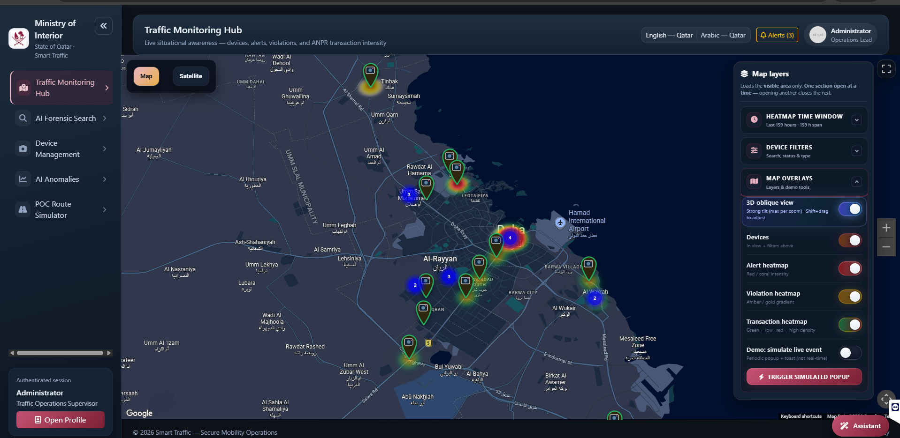
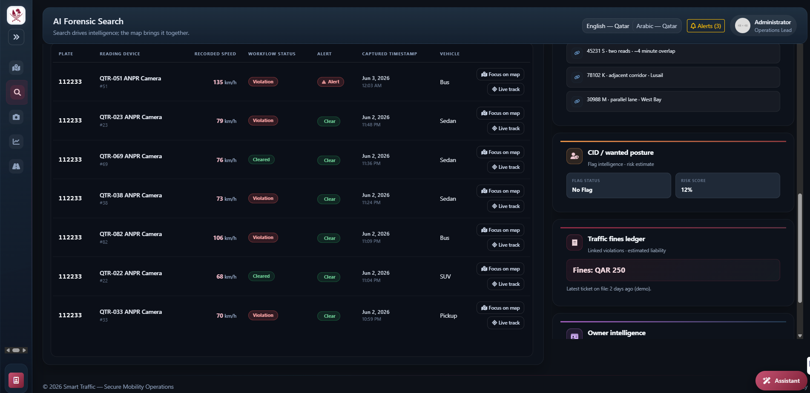
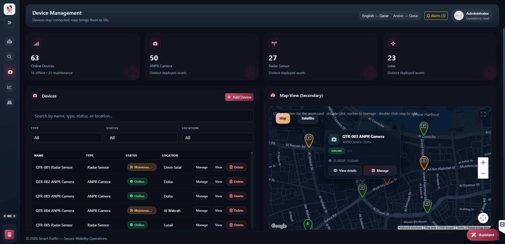
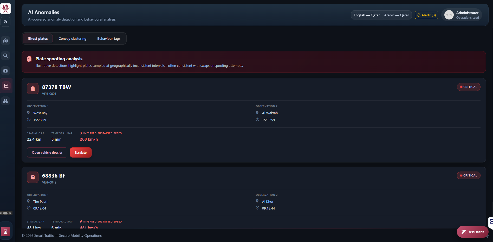
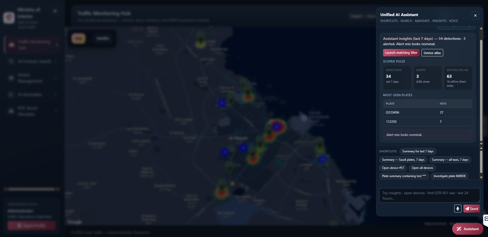

# Smart Traffic Tool

ASP.NET Core web application for **traffic operations and ANPR (Automatic Number Plate Recognition) forensics**. It provides a command-center map, plate search, device management, and analytics dashboards backed by a local SQLite database with demo seed data.

Built for **Ministry of Interior–style traffic monitoring** workflows (Qatar-centric demo geography), with **English and Arabic (Qatar)** UI support.

## Features

| Module | Description |
|--------|-------------|
| **Traffic Monitoring Hub** | Live-style command map with ANPR camera markers, alert/violation/transaction **heatmaps**, device filters, and incident popups with plate investigation links |
| **AI Forensic Search** | Hybrid search by plate, time window, and device; map view with markers, heatmap, and optional plate journey tracking |
| **Device Management** | CRUD for cameras/sensors, status, streams, and per-device detail maps |
| **AI Anomalies** | Forensic analytics charts and anomaly views |
| **Copilot panel** | Natural-language intent helper for navigation and common actions |
| **PoC Route Simulator** | Development/demo tool to simulate routes and append ANPR reads (config-gated) |

## Screens










## Tech stack

- **.NET 10** — ASP.NET Core MVC  
- **Entity Framework Core** — SQLite (`smarttraffic.db`)  
- **Google Maps JavaScript API** — maps, markers, clustering (heatmap via `visualization` library on API **v3.64**)  
- **Bootstrap 5** — dark UI, RTL for Arabic  
- **Chart.js** — analytics charts  
- **Font Awesome 6**

## Prerequisites

- [.NET 10 SDK](https://dotnet.microsoft.com/download)  
- [Google Maps Platform API key](https://developers.google.com/maps/documentation/javascript/get-api-key) with **Maps JavaScript API** enabled  

## Quick start

1. **Clone the repository**

   ```bash
   git clone https://github.com/YOUR_USERNAME/smarttraffictool.git
   cd smarttraffictool/SmartTrafficTool
   ```

2. **Configure secrets** (do not commit real keys)

   Copy the example settings file and add your API key:

   ```bash
   copy appsettings.Development.json.example appsettings.Development.json
   ```

   Edit `appsettings.Development.json`:

   ```json
   {
     "GoogleMaps": {
       "ApiKey": "YOUR_GOOGLE_MAPS_API_KEY"
     }
   }
   ```

3. **Run the app**

   ```bash
   dotnet restore
   dotnet run
   ```

   Open the URL shown in the console (typically `https://localhost:7xxx`). The database is created and seeded on first run.

## Configuration

| Setting | Description |
|---------|-------------|
| `ConnectionStrings:DefaultConnection` | SQLite path (default: `smarttraffic.db`) |
| `GoogleMaps:ApiKey` | Required for map pages |
| `PocDemo:AllowAppendRecentData` | Enables PoC simulator nav and data append (default `true` in Development) |

Maps load with **API v3.64** and the **visualization** library so legacy `HeatmapLayer` continues to work until Google removes it in a future Maps JS release.

## Project structure

```
smarttraffictool/
├── SmartTrafficTool/
│   ├── Controllers/       # MVC + API endpoints (map data, search, copilot, etc.)
│   ├── Data/              # EF Core DbContext and seed data
│   ├── Models/            # ANPR transactions, devices, map DTOs
│   ├── Services/          # Copilot intent parsing
│   ├── Views/             # Razor UI (Command & Control, Search, Devices, …)
│   ├── wwwroot/           # CSS, JS, images
│   └── Resources/         # Localization (en, ar-QA)
└── README.md
```

## Localization

Supported cultures: **en**, **ar-QA** (RTL). Culture is stored in a cookie and can be switched from the UI.

## Security notes

- Never commit `appsettings.Development.json` or API keys to a public repository.  
- Use GitHub **Secrets** for CI/CD and environment-specific configuration in production.  
- Restrict your Google Maps API key by HTTP referrer and enabled APIs.

## License

Private / internal use unless a license file is added by the repository owner.

## Acknowledgments

Demo ANPR imagery and seed data are for **proof-of-concept and demonstration** only, not production enforcement systems.
